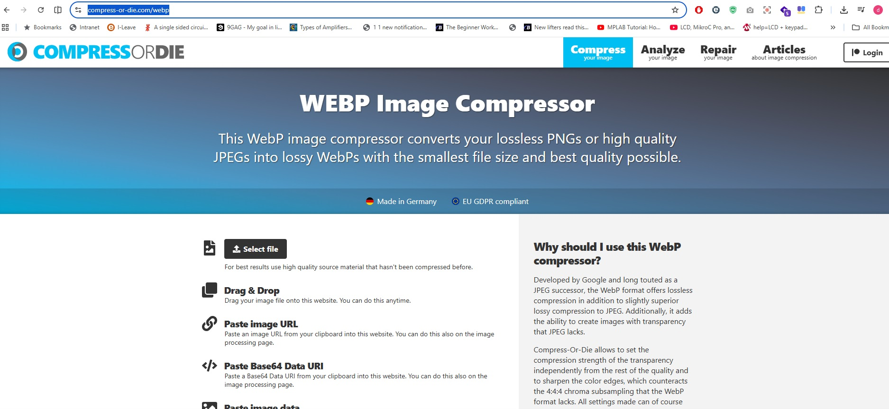

# Front End Technical Specification

- Create a Static Website that serves a HTML website.

## Resume Format Considerations
- Since I'm based in Malaysia, where resumes traditionally follow a format that includes  more personal information than Western standards.

- Malaysian resumes typically include:
    - Age 
    - Date of Birth
    - Marital Status
    - Gender
    - Nationality / Race
    - Photo
    - CGPA 

- I will use the [Harvard Resume Template](https://careerservices.fas.harvard.edu/resources/bullet-point-resume-template/) as the basis but will tweak it to Malaysia industry standards. And it is also ATS-Friendly.

### Harvard Resume Format Generation

Since I'm not that familiar with HTML, so I will used either ChatGPT or Claude or Gemini to convert the Harvard resume template into HTML as a starting point and will tweak it to my preferred standard.

The Prompt that will be used is this:

```text
Convert this resume format into html.
Please don't use a css framework.
Please use the least amount of css tags.
```

Below is the image provided to the LLM:


This is the [generated output](./Docs/19th%20May%202026%20Resume.html) which I will
tweak.

This is what the generated HTML looks like unaltered:


## HTML Adjustments

- We be using the UTF-8 meta charshet as it can support most languages.
- Will be applying the mobile styling to our website. So we be including the: viewport meta tag =device-width so mobile styling scales normally.
- We will extract our styles into its own stylesheet after we are happy with our HTML markup.
- We will simpligy our HTML markup CSS selector to be minimal as possible.


## Serve Static Website Locally

We need to server out static website locally so we can start using stylesheets externally from our HTML page in a CDE.

This is not necessary with local development.

assuming already node install, we use the simple web-server http-server

### Install HTTP Server
```sh
npm i http-server -g
```

https://www.npmjs.com/package/http-server

### Server Website

http-server will server a pulic folder by default.
the command is run.

```sh
cd FrontEnd
http-server
```

### Image Optimization

Image optimization is needed if you want the backgroud (body) from an image.
usually an image has a large size. the app that I use for it is call webpn.
I did try it and optimize it, but the backgroud seem to weird for it. so I left it out. would probably use it when using real image for myself.

https://compress-or-die.com/webp




## Frontend Framework Consideration

- Chose to use React because its the most popuplat javascript framework.
- Chose to use Vite.js over wevpack vecause our frontend is very simple.
- Configured React Router V7, decided to use declaritvve mode because again our app is very simple.